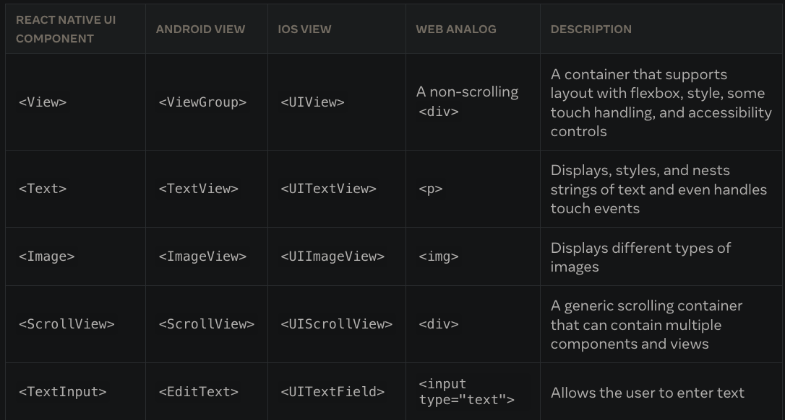
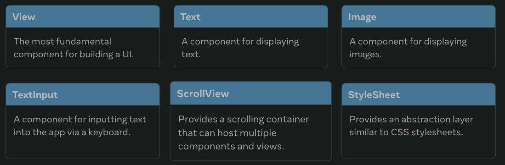
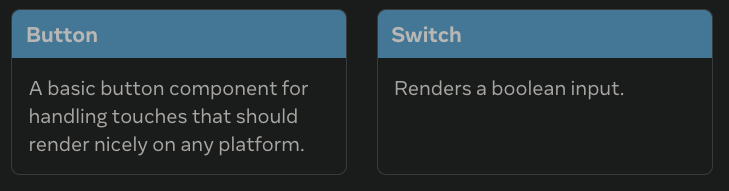

# Learning React native <!-- omit in toc -->

# Table of content <!-- omit in toc -->

- [1. Introduction](#1-introduction)
  - [1.1. Why react native?](#11-why-react-native)
  - [1.2. Other solutions](#12-other-solutions)
  - [1.3. Pros and cons](#13-pros-and-cons)
- [2. Setup a React native project](#2-setup-a-react-native-project)
  - [2.1. Macos](#21-macos)
  - [2.2. Windows](#22-windows)
- [3. Views](#3-views)
  - [3.1. Components](#31-components)
  - [3.2. APIs](#32-apis)
- [4. Practice](#4-practice)
  - [4.1. Camera Notch](#41-camera-notch)
    - [4.1.1. IOS fix](#411-ios-fix)
    - [4.1.2. Android fix](#412-android-fix)
  - [4.2. Input](#42-input)
  - [4.3. Keeping the phone awake](#43-keeping-the-phone-awake)
    - [4.3.1. FlatList](#431-flatlist)

# 1. Introduction

## 1.1. Why react native?

To develop for ios, we need to use Objective C or swift
To develop for android, we need to use Java or Kotlin

So, we needed create code 2 times to have our apps working on both.

React Native is a cross platform solution that allows us to use Javascript to target all devices at the same time.

## 1.2. Other solutions

1. Xamarin
2. Flutter
3. Cordova
4. PWA
5. Ionic

## 1.3. Pros and cons

+: We only have one codebase
-: Will always be slower than a native app built on native device code

# 2. Setup a React native project

## 2.1. Macos

1. Installing yarn

```bash
npm install --global yarn
```

2. Expo CLI

```bash
sudo npm install -g expo-cli
```

3. Install XCode
4. Launch simulator IOS

```bash
yarn ios
```

5. Download Android studio: https://developer.android.com/studio?gclsrc=ds
   Open => More actions => Virtual device manager => play

## 2.2. Windows

# 3. Views

Views are the building block of the UI in React native.
They are equivalent to our Html elements, but are specialized for mobile.

Instead of this:

```jsx
<div>
  <p>Hello world</p>
</div>
```

We will have

```jsx
<View>
  <Text>Hello world</Text>
</View>
```

In React Native, we will for example use the component `<Image></Image>`, but under the hood:

1. When exporting in IOS RN will make it a `<UIImageView></UIImageView>`
2. When exporting to Android, it will make it s `<ImageView></ImageView>`



## 3.1. Components

Views are essentially components.
There are several types:

1. Core components
2. Community components
3. Custom components

https://reactnative.dev/docs/components-and-apis

Basic components:


User interface components:


There are also components that are android and ios specific,

## 3.2. APIs

React Native APIs are functions/tools that allow us to add special functionality.
For example:

1. Keyboard: https://reactnative.dev/docs/keyboard
2. Dimensions: https://reactnative.dev/docs/dimensions
3. Stylesheet: https://reactnative.dev/docs/stylesheet
4. Vibration: https://reactnative.dev/docs/vibration

So to use Dimensions, we would do:

```js
import { Dimensions } from "react-native";

export default function App() {
  return (
    <View>
      <Text>Hello world</Text>
    </View>
  );
}
```

# 4. Practice

Units are density based units

## 4.1. Camera Notch

To avoid hitting the notch, we can use SafeAreaView on ios, but it does not work for Android.

### 4.1.1. IOS fix

```js
export default function App() {
  return (
    <SafeAreaView style={styles.container}>
      <Text style={styles.text}>Hello</Text>
    </SafeAreaView>
  );
}
```

### 4.1.2. Android fix

```js
import {
  SafeAreaView,
  Text,
  StyleSheet,
  Platform,
  StatusBar,
} from "react-native";

export default function App() {
  return (
    <SafeAreaView style={styles.container}>
      <Text style={styles.text}>Hello</Text>
    </SafeAreaView>
  );
}

const styles = StyleSheet.create({
  text: {
    backgroundColor: "green",
    height: 50,
    color: "white",
    fontSize: 32,
  },
  container: {
    flex: 1,
    paddingTop: Platform.OS === "android" ? StatusBar.currentHeight : 0,
  },
});
```

## 4.2. Input

Using react native paper: https://reactnativepaper.com/

## 4.3. Keeping the phone awake

Expo keep awake

### 4.3.1. FlatList
